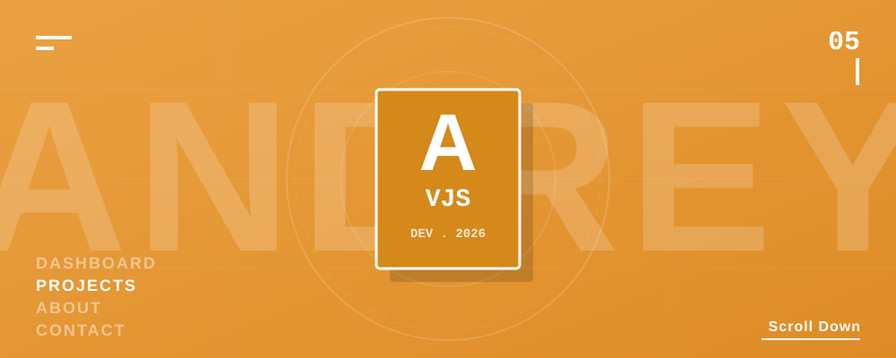

  

  <h3>⚡ Transformando Minhas Ideias em Realidade através de Código ⚡</h3>
  
<i>Estudante de Análise e Desenvolvimento de Sistemas (ADS) &amp; Desenvolvedor Backend </i>

 

  
  
  
  

***

## 👨‍💻 Um Pouco Sobre Mim
> *"Terceiro semestre de Análise e Desenvolvimento de Sistemas (ADS)"*

Meu nome é **Andrey Vinicius**. Tenho certa experiência no ecossistema **Backend**, utilizando **Java** e **Kotlin** para criar a estrutura de meus projetos. 

Atualmente estou em busca de acompanhar as exigências do mercado para o futuro, expandindo meu conhecimento para o universo. **De aplicações multiplataforma**, dominando tanto o backend quanto o frontend e alcançando atuações na stack completa. Dedico meu tempo criando plataformas e **WebApps** com designs marcantes e lógicas consistentes, para transformar ideias em produtos incríveis.

## 🛠️ Tecnologias & Habilidades

| Especialidade | Tecnologias |
| :--- | :--- |
| **Backend Core** |    |
| **Web** |    |

## 📊 Meus Status Atuais

  
  

***

  
<i>"Hello World."</i>

